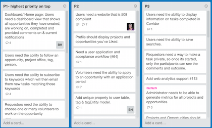
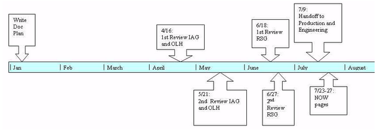

It is important that any project created and posted to the pilot program encourages others to apply and begin working on the posted project. One thing to consider is that project writing is hard.  You need to get a few people together during the planning stage to get a feel of what it is like to write effective project descriptions -- remember these will serve as a "call to action" and need to inspire participants!

*Identifying projects*

* Does the current team not have the skills necessary to solve this problem?
* Does the problem require external input?
* Does the problem support virtual contributions?
* By collaborating on this project, does an employee expand their network?
* Does a solution to the problem has measureable outcomes of success?
* Can a team work on a solution in their “free time?"

*Writing new projects*

The description needs to provide enough information to allow someone to understand what the purpose of the project is and why they might want to work on it.

* Begin with an outline that lists the problem that needs to be solved, why it needs solving and what outcome you hope for or expect. People are more likely to select a project if they have a clear sense of what success looks like.
* Add more detail about the project so that the reader fully understands the problem, the need for a solution, and how working on the project might benefit them or have a big impact.
* Describe what skills are needed, making it clear who is be eligible to work on the project.
* Define a start and end date, or how much time you expect it to take
* Define the size of the team the project would need to complete it

*Before Posting Projects*

Consider finding some folks to pick up some projects even before your official launch. Then you will get a feel for the process and you might generate success stories or quotes that you can use to help with marketing later.

* Brainstorm how you might market the project around your agency. Are there relevant mailing lists or working groups where you might find folks interested in participating?
* Create “what’s in it for me?” language to encourage people to apply
* Make sure project creators are prepared to respond to participants in a timely manner

*Project Feedback*

Encourage project creators to give feedback directly to participants. Remember, you want to encourage people to
take risks and be ambitious in the projects they select so there should not be negative consequences if they
don't complete the project exactly as the project creator envisioned.

* Encourage participants to take risks
* Remember this is not a performance review, although you should feel free to send *postitive* feedback to the participant's supervisor.
* Focus on work done not the person
* Give constructive feedback
* Articulate outcomes once project is completed.
* Share success stories on blogs and agency newsletters.

*Additional references*

* [Open Opportunities Task Creator Toolkit](http://www.digitalgov.gov/resources/open-opportunities-task-creator-toolkit/)
* [10 Tips for Creating the Perfect Open Opportunity Task](http://www.digitalgov.gov/resources/open-opportunities-task-creator-toolkit/10-tips-for-creating-the-perfect-open-opportunity-task/)

##Project management techniques##
Many program teams are leading their first project when they decide to head up a new agile workforce program. Several tools are available to help project leads determine what work needs to get done and when it makes since to establish deadlines for that work. To aid in planning and managing of the new program, below are some common techniques for managing a project:

###Project Plans###

Consider using agile planning tools like [Trello](https://trello.com/) which offers free accounts.

Tools like this enable an online version of the kanban approach, where you write a story about
what needs to happen on each card.  You will typically have a column for done, in progress, upcoming, and ideas.  
Then you move the cards as you get things done.  Each card should represent something that will take a few hours
or at most a few days. Bigger stories should be broken down the the smallest possible task where results will
be visible to your team. Then everyone can track how the the project is moving forward.

You can then manage to a schedule by doing the most important things first and moving forward when you've done enough to meet the key needs for each phase of the project.

###Milestones###

Keep a sense of shared milestones helps the team stay on track.  This could be as simple as a shared Google Doc
or you could visualize it for your team using a diagram:

##Share What You Learn##

In creating a pilot, the goal is to learn what works.  It is essential to document what you are doing and what you are learning. Figure out where you can put information which everyone will have access to.  Develop a Wiki devoted to the project to ensure knowledge management of best practices and lessons learned. Or, use other ways to curate or capture and disseminate knowledge and platforms to host this activity such as WordPress, SharePoint, Google Docs, or other tools your agency supports.

Share publicly what you are doing and what you learn. Blog throughout your project development.  This will help you gain supporters and participants.  People love to be involved from the beginning and read stories on how things happen.  Often we hear about what is happening at our own agency from a friend at another agency who heard about it.  Making things public accelerates communication and increases participant within your own agency.

Key drivers for effective knowledge management and communication:

* Reduce the time and effort spent in gathering required information for project execution
* Improve reusability or avoid reinvention
* Reduce dependency on a few individuals for the project’s overall success
* Improve the overall project team’s productivity
* Recruit supporters and participants

To encourage widespread engagement throughout the team and to bolster the business case for the project, it is important to prove the concept within individuals and teams across the organization.
