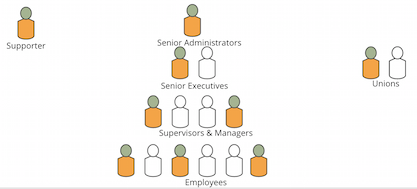

The ideal team involves people at all levels of the agency; however, you can get
started with a team at any level.  As you think about adding members to your team
brainstorm who you know or have heard of who has shown an interest in these ideas
and is outside of your immediate workgroup.

The most important people compose the team behind the agile workforce program. This team doesn’t need to be large to do the design, planning, and launching of the program, however it does take one that is dedicated and engaged. Several key roles make up this program team:

###Program Lead(s)###
The program lead(s) are dedicated employees that are excited to introduce a new way of working within their agency. These
may be individual contributors on their own teams, but will act as leaders for the initiative.  They know that the current method of getting work done isn’t supporting the agency workforce anymore and a new way of working is needed to recruit and retain new staff, as well as meet the demands of the modern day.

###Program Sponsor###
Every agile workforce program needs one or more sponsors to help a program team gather the necessary information and to approve of their efforts. These sponsors will lower the internal barriers to assist the program team in meeting with other stakeholders around the agency and review the work products that team creates as it designs and plans the program.  While it is helpful to have a sponsor in the Administrator's office or the Office of the Secretary of your agency, successful
agile workforce initiatives have started out of many different offices -- any supervisor who understands the need For
a program can act as a sponsor, authorize staff time and help recruit additional supporters and team members.

###Program Team Members###
Every program team needs helping hands to get a new program up and running. These are other employees or supervisors who are passionate about getting an agile workforce program going at your agency. They may not be able to lead the initiative due to other work responsibilities, but may have a few spare hours in a week to lend a hand.

It’s important that you take the time to include stakeholders at every level, described in detail below, to co-design the program together. This human-centered approach will help you create a successful progream, by working with people to validate early concepts before they become fully established as core components of your agile workforce program.

In addition to the core team, many different kinds of people need to be involved throughout the design and planning
process:

* [Agency Mentors]
* [Participants]
* [Supervisors]
* [Senior Executive Support]

##Agency Mentors##
Mentoring is usually a formal or an informal relationship between two people, which occurs for some time, usually between a senior employee and a junior protege’, usually someone who is not directly supervised by the mentor, according to an [OPM best-practices guide](https://www.opm.gov/policy-data-oversight/training-and-development/career-development/bestpractices-mentoring.pdf).

Mentors are key in many instances to alerting colleagues about opportunities to expand their expertise and gain valuable professional development experience. The relationship affords an opportunity for knowledge sharing between inexperienced and senior team members and contributes to enhancing branding of the organization by signaling your organization values employee development.

In the federal government, mentoring can be a precursor for additional career development or participation in formal programs including the Executive Leadership Program, the Presidential Management Program, and the Senior Executive Service Candidate Development Program, according to OPM.

“Some mentor programs have flourished. The Environmental Protection Agency’s Skills Marketplace has become established within the EPA as an effective resource for managers. Open Opportunities has grown dramatically and is now open to all federal employees,” according to a [September 2015 blog post](https://18f.gsa.gov/2015/09/01/govconnect-launch/) published by 18F about the GovConnect initiative.

The aim of GovConnect to help agency leaders connect their employees to innovative work on a part-time basis, to one another, and to their agency’s mission.

In a successful mentoring relationship, the mentor and mentee both find great satisfaction. Among the common outcomes are:

* Developed coaching and leadership skills for the mentor as well as reinforcement of their own knowledge and career goals
* An ability to grow for the mentee by experimenting, learning and trying new approaches in a safe environment

[comment]: FIXME: **PLACEHOLDER: Types of mentors/mentorship relationships/examples of models**

[comment]: FIXME: **Content Suggestions:**

[comment]: FIXME: **Mentor relationships matched based on common purpose and mission**

[comment]: FIXME: **Mentors should be proactive in giving guidance and direction to partner agencies**

[comment]: FIXME: **Provide mentors with basic training on mentorship and relationship building**

[comment]: FIXME: **Describe the benefits to a new program team by participating in a mentor program**

[comment]: FIXME: **Establish communication schedule and needs and methods**

##Participants##
A common pitfall for many pilot is trying to create a program that is meant for every employee at first launch. While this is a good long-term goal, at first it’s best to focus on one or two specific types of participants and project submitters. Creating a profile of your target audience, based on actual knowledge of real people at your agency is key to the design process. Before you make a launch plan, you should have talked to at least 15-20 people in your target audience and
have 8-10 who are excited to try it out as soon as it launches.  Throughout your design process, a deep understanding
of these individuals, and why the program inspires and excited them will lead you to create something incredible.  
A profile of your target audience that typically combines what you've learned from many people and represents a larger
number of people at your agency is a great tool in this process.

These profiles should include basic demographic information about the type of person that would apply for a project or create a new project. Additionally, behavioral information should be included that speaks to why that type of person would want to apply for a project or create a new project. The below format can help teams quickly create the artifact and then use it to guide future decision on how the pilot should be planned, designed, and marketed.

##Sample Profile##

###Participant Profile###

###Senior Executive Support###

* What channels do you have to gain the commitment and support of senior leadership? Are there senior leaders who have helped define a mentoring program at your agency?
* Is there established leadership training at your agency?  Graduates of such programs are great candidates to get involved.  Find out how those programs got started.  Those sponsors or leaders of the program may be interested in getting involved.
* Brainstorm way to invite the senior leadership to help define your goals.  Are there current initiatives in your agency that could be achieved with this agile workforce program?

###Supervisors###

Talk to supervisors about the problems they face to understand how to position your program or find team members or
supporters.

* What are the problem and concerns of supervisors in your agency?
* Which ones already have employees who collaborate across-teams or across agencies?  What value does that work bring back to their teams?
* Are there supervisors who have fears about employees doing work outside of their own team?  How can those fears be resolved or mitigated?
* Are there regular supervisor trainings or meetings where you can reach out to new people throughout the process?

###Union Relations###

Pilot programs have been very successful when talking to union leaders early, before a program is established or
detailed planning has begun. There is clear evidence that agile workforce programs provide much needed professional
development and leadership opportunities. Identify the needs of their members and their concerns that could
be addressed by your program.

* What ways can you draw upon the experiences of union leaders?
* Are there documents or other measures that unions have already established that you need to be aware of in designing your program?
* What ways will union representatives help you define clear goals?
* How can unions be included in the planning and design of a program?
* How can you address common concerns from your unions?
